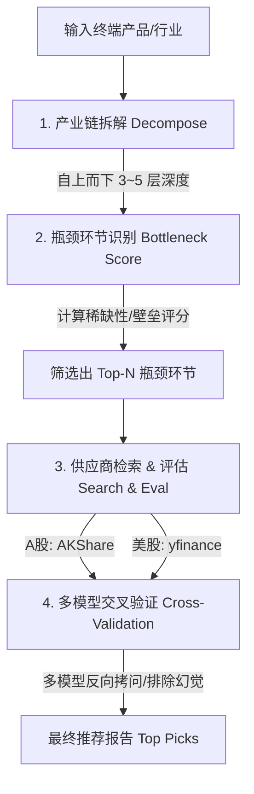

# BottleneckHunter (瓶颈猎手) — AI 产业链瓶颈选股系统

[](https://github.com/Acclerate/BottleneckHunter/blob/main/LICENSE)
[](https://pyproject.toml)

**BottleneckHunter** 是一个基于 AI 和大语言模型（LLM）的**产业链瓶颈与“卡脖子”供应商选股系统**。本项目的核心投资方法论源自古宇家办对 Serenity 的 **“三步选股法”**（产业链拆解 → 供应商检索 → 多模型交叉验证）的深度解读。

系统不鼓励追逐短期热门的终端概念股（例如最火爆的 GPU 厂商），而是通过算法和 AI，**挖掘支撑热门产业运转、但在物理上极度稀缺、不可替代、且被市场和机构所忽视的上游瓶颈供应商**（如光模块、激光器、高纯度衬底、关键生产设备等）。

---

## 核心方法论：Serenity "三步法"



### 第一步：产业链深度拆解 (`Decompose`)
从用户指定的终端产品（如 *人形机器人*、*GPU / AI 算力*、*商业航天*）或系统自动检测到的实时热点行业出发，利用大语言模型逐层向上溯源 3 层以上，结构化还原出所有零部件、原材料、生产设备和工艺环节。

### 第二步：瓶颈环节精准打分 (`Bottleneck Score`)
根据五个关键维度，对产业链中的每一个细分环节进行定性与定量混合评分：
1. **稀缺性 (`Scarcity`)**：全球供应商数量与市场集中度。
2. **不可替代性 (`Irreplaceability`)**：是否存在低成本、成熟的替代材料或方案。
3. **供需缺口 (`Supply-Demand Gap`)**：当前及未来可预测的供需紧张程度。
4. **定价权 (`Pricing Power`)**：能否向下游顺利转嫁原材料涨价成本。
5. **技术壁垒 (`Technical Barrier`)**：专利门槛、工艺诀窍（Know-how）以及下游客户的认证周期。

通过对上述指标进行加权平均计算，自动筛选出得分最高的 `Top-N` 个瓶颈环节。

### 第三步：供应商检索、评估与多模型交叉验证 (`Search, Eval & Cross-Validation`)
- **供应商检索**：
  - **A股**：通过 [AKShare](https://github.com/akshare/akshare) 爬取东方财富概念/行业板块的实时成分股，重点筛选**小市值**且尚未被机构大举重仓的隐藏龙头。
  - **美股**：通过 [yfinance](https://github.com/ranarousman/yfinance) 检索行业分类并过滤。
- **供应商评估**：针对候选标的，从*市场地位*、*大客户验证*、*产能状态*、*财务健康*、*估值水平*五个维度生成量化评分卡（Scorecard）。
- **多模型交叉验证**：为了杜绝单模型幻觉并提高投资胜率，系统引入**多模型反向拷问机制**。可配置多个主流 LLM（如 GPT、Claude、DeepSeek），让它们扮演“最苛刻的反方评委”，从技术颠覆、客户流失、估值透支、地缘政治等反面视角对投资逻辑进行无死角审查，最终只推荐通过多数模型共识的优质标的。

---

## 特色功能：实时热点扫描与轮动题材检测

除了手动分析指定的产业链，系统内置了**基于东方财富实时数据的热点检测器 (`HotSectorDetector`)**：
- 结合**板块涨跌幅**、**换手率异常**、**主力资金净流入**以及**上涨下跌家数比（Breadth）**等实时行情指标，自动计算全市场行业/概念的综合热度评分。
- 精准捕捉正在悄然起势的**新兴题材轮动信号**，直接作为产业链分析的输入源。实现“实时发现热点 $\rightarrow$ 一键拆解产业链 $\rightarrow$ 寻找卡脖子供应商”的完整闭环。

---

## 目录结构

```text
BottleneckHunter/
├── bottleneck_hunter/
│   ├── cli.py                  # 交互式命令行入口
│   ├── chain/
│   │   ├── models.py           # 核心数据模型 (Pydantic v2)
│   │   ├── decomposer.py       # 产业链拆解引擎 (LLM 驱动)
│   │   ├── bottleneck.py       # 瓶颈评分与识别算法
│   │   ├── supplier_search.py  # 供应商数据库检索 (AKShare / yfinance)
│   │   ├── supplier_eval.py    # 供应商评分卡生成
│   │   ├── cross_validation.py # 多模型反向交叉验证框架
│   │   ├── graph.py            # LangGraph 工作流状态编排
│   │   ├── report.py           # 报告生成器 (Markdown)
│   │   ├── prompts/            # LLM System Prompts (拆解、评估、交叉验证)
│   │   └── data/               # 预设产业链本地数据库 (GPU、机器人、商业航天等)
│   ├── llm_clients/
│   │   └── factory.py          # 多模型 LLM 客户端工厂
│   └── dataflows/              # 数据流接口
├── tests/                      # 单元测试 (100% 覆盖核心逻辑)
├── pyproject.toml              # 项目依赖与打包配置
├── .env.example                # 环境变量配置模板
└── PLAN.md                     # 开发规划路线图
```

---

## 快速开始

### 1. 安装项目

确保您的系统已安装 Python 3.10+。克隆本项目后，建议使用虚拟环境进行安装：

```bash
# 克隆仓库
git clone https://github.com/Acclerate/BottleneckHunter.git
cd BottleneckHunter

# 创建并激活虚拟环境 (可选)
python -m venv .venv
source .venv/bin/activate  # Windows 下运行: .venv\Scripts\activate

# 以编辑模式安装项目及依赖
pip install -e .
```

### 2. 配置 API 密钥

在项目根目录下，将 `.env.example` 复制并重命名为 `.env`：

```bash
cp .env.example .env
```

打开 `.env` 文件，根据您的需要配置各 LLM Provider 的 API 密钥（如 Openai, Anthropic, DeepSeek, DashScope 等）：

```env
OPENAI_API_KEY=your-openai-key
ANTHROPIC_API_KEY=your-anthropic-key
DEEPSEEK_API_KEY=your-deepseek-key
```

### 3. 运行命令行工具 (CLI)

#### 🚀 启动完整产业链选股工作流
运行以下命令进入全中文的交互式向导，系统将一步步指引您完成行业选择、拆解、检索及交叉验证：

```bash
bottleneck-hunter screen
```

*向导流程概览：*
1. **选择模式**：自动检测当前最火爆的热点板块，或直接在预设产业链（GPU、机器人、商业航天、新能源车等）及自定义行业中手动选择。
2. **设置参数**：指定拆解深度（3~5层）、返回的瓶颈环节数量、搜索的目标市场（A股/美股/全部市场）以及市值过滤上限。
3. **选择 LLM**：配置用于产业链拆解和评估的主模型。
4. **多模型验证**：选择是否启用交叉验证，并输入用于交叉验证的模型列表（如 `openai:gpt-4o,anthropic:claude-3-5-sonnet,deepseek:deepseek-chat`）。
5. **生成报告**：工作流执行完毕后，控制台会输出直观的 Rich 表格，并在 `output/` 文件夹下自动保存一份详尽的 Markdown 格式投资报告。

#### 📊 仅进行当前全市场热点板块快速扫描
如果您只想查看目前 A 股市场主力资金在买什么、哪些题材正在产生轮动信号，可以直接运行：

```bash
bottleneck-hunter hot
```
该命令会获取东财最新的板块数据并打印直观的排名表，同时在 `output/` 中保存扫描快照。

---

## 部署（生产）

Web 服务 + 内置定时任务为单容器 Docker 部署。首次部署、升级、回滚与数据源说明见
**[docs/DEPLOY.md](docs/DEPLOY.md)**。升级只需：

```bash
git pull origin main
HOST_PORT=8089 docker compose up -d --build
```

---

## 运行测试

本项目配备了完整的单元测试，涵盖了数据结构、模型解析、评分逻辑以及东财热点扫描模块。在开发时可随时通过 pytest 运行：

```bash
pytest
```

---

## 声明

*本系统输出的全部内容（包括但不限于产业链拆解、瓶颈环节评分、供应商评分及多模型交叉验证意见）均由 AI 算法和公开市场数据计算生成，**不构成任何形式的投资建议**。股市有风险，入市需谨慎。*

---

## 致谢
- 感谢古宇家办对 **Serenity 200倍选股奇迹** 方法论的精彩拆解。
- 感谢 [AKShare](https://github.com/akshare/akshare) 提供的金融数据接口支持。
